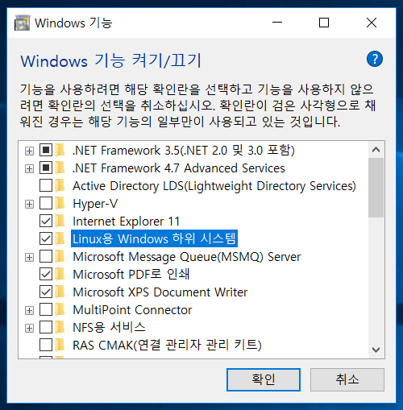
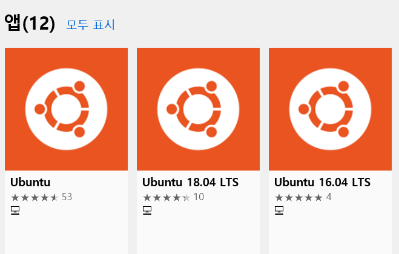
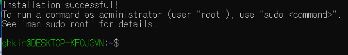


## 1. 설치 가능 조건
WSL을 설치하기 위해서는 64비트 PC, Windows 10 1607 이상이면 가능합니다. 본인 컴퓨터의 윈도우 버전을 확인하기 위해서는 아래의 경로로 들어가면 됩니다. 

> 설정 > 시스템 > 정보   

그러면 아래와 같이 사양을 확인할 수 있습니다.   

## 2. WSL설치하기 
WSL의 설치과정은 크게 세 단계로 나누어집니다. 첫 번째 단계는 WSL의 설치를 위해서 윈도우 기능을 켜는 것, 두 번째 단계는 window store에서 ubuntu를 설치하는 것, 그리고 마지막은 설치 된 ubuntu를 실행해 계정을 만드는 것 입니다. 

### 1. 윈도우에서 Linux용 하위 기능 켜기
윈도우에서 Linux용 하위 기능을 켜기 위해서는 "Windows 기능 켜기/끄기"를 검색해서 들어가면 됩니다. 그 후에 아래 그림과 같은 "Linux용 Windows 하위 시스템"을 체크 하면 됩니다. 이제 첫 단계가 끝났습니다!

### 2. Window store에서 ubuntu 설치하기
이후에 window store에 접속해서 ubuntu를 설치하면 됩니다. 아래 그림과 같은 아이콘을 실행한 뒤, 무료 > 설치 를 클릭해 설치를 하면 됩니다. 

### 3. Ubuntu 계정 만들기
위의 설치가 마무리 되었다면 설치 된 응용프로그램 Ubuntu를 실행합니다. 그러면 다시 설치중이니 기다리라는 메시지가 나옵니다. 

> Installing, this may take a few minutes... 

수 분을 기다린 뒤에 아래 이미지와 같이 계정을 등록하라는 문구가 나오면 user id와 passwd, passwd 확인을 순차로 입력하면 됩니다. 

그러면 설치가 모두 끝났습니다!

## 3. WSL 기본 사용법

